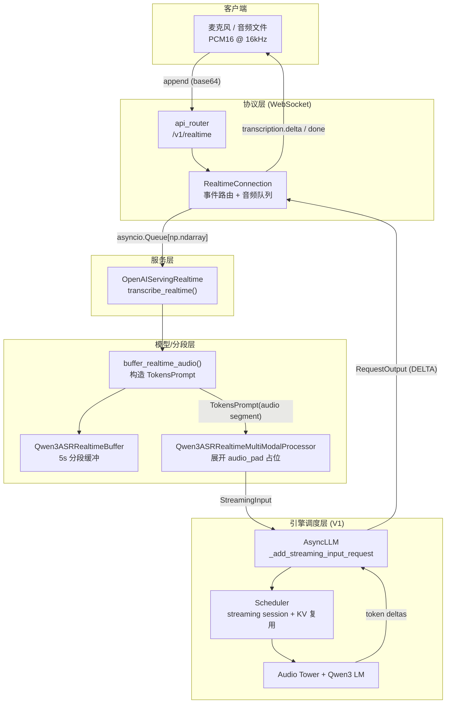
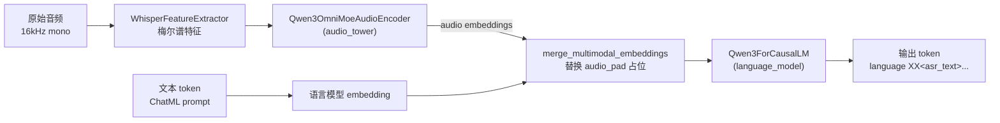
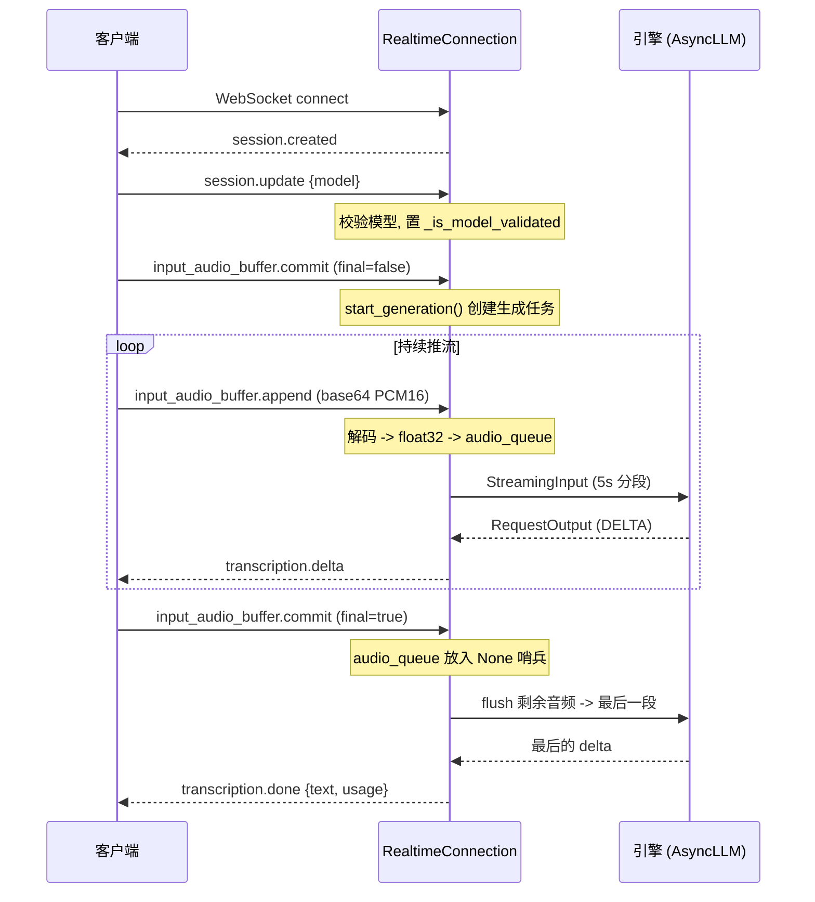
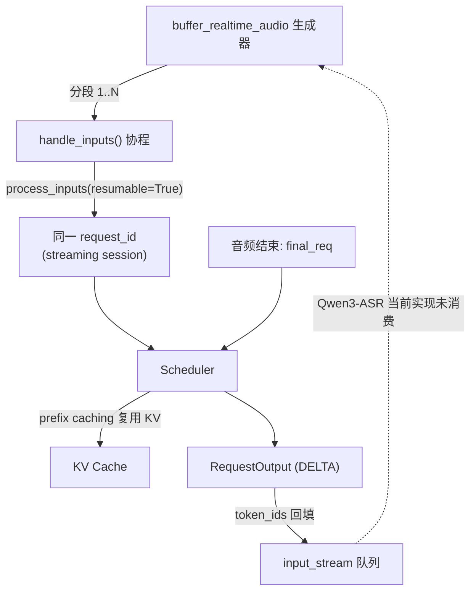
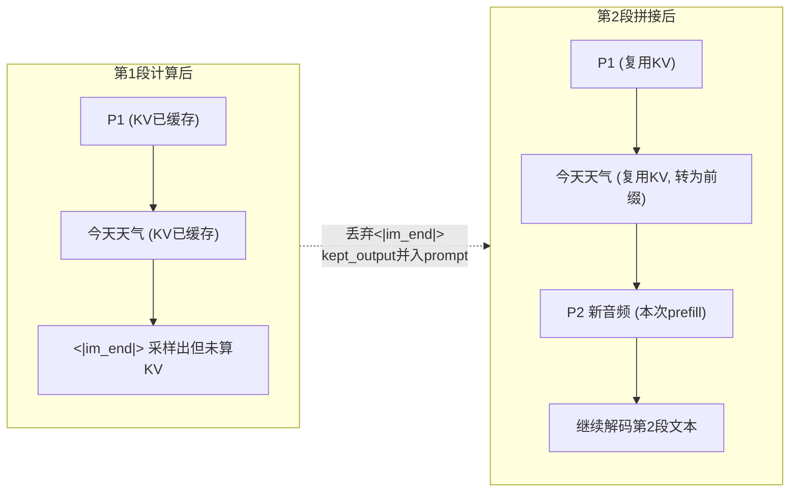
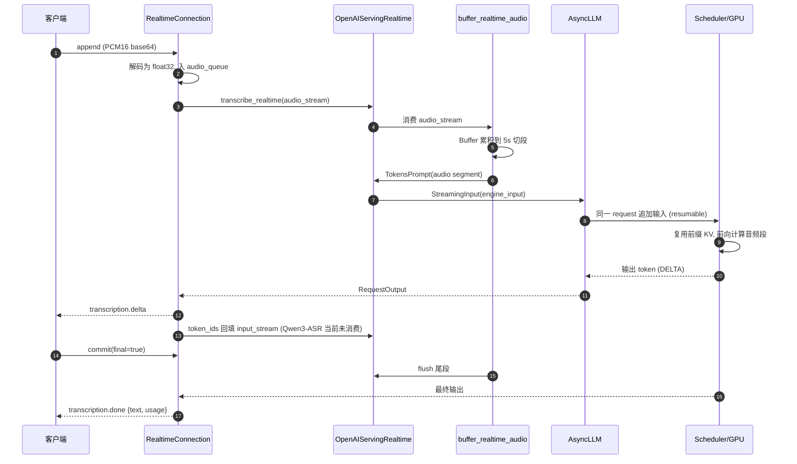
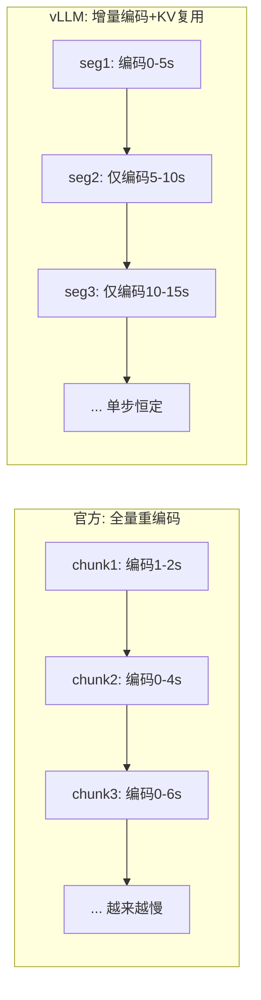
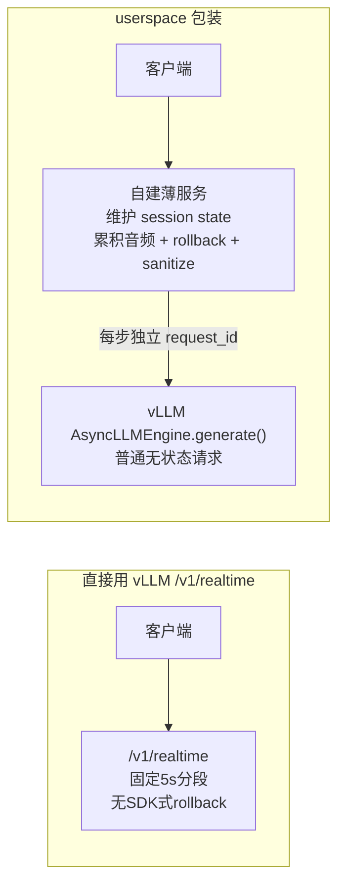

# Qwen3-ASR Realtime 实时语音转写实现分析

> 本文基于 vLLM 源码，系统分析 `Qwen3ASRRealtimeGeneration` 实时（流式）语音识别（ASR）的实现原理、整体架构、关键组件与端到端数据流。

## 1. 概述

Qwen3-ASR Realtime 是在 vLLM 中为 Qwen3-ASR 模型提供的**低延迟流式转写**能力。它通过 WebSocket 接收持续到达的音频流，边接收边转写，并以增量（delta）方式把识别文本实时推送回客户端。

与一次性把整段音频送入模型的「批式转写」（`/v1/audio/transcriptions`）不同，实时端点的核心诉求是：

- **边收边算**：音频还没说完就开始出字，降低首字延迟与端到端延迟。
- **分段处理**：把连续音频切成固定时长的小段（默认 5s）逐段送入引擎。
- **引擎级会话延续**：所有分段挂在同一 request 上，调度器可复用历史 KV；但当前 Qwen3-ASR realtime 尚未实现官方 SDK 式的 `response_prefix`/rollback 跨段续写。

涉及的主要源码文件：

| 层次 | 文件 | 职责 |
| --- | --- | --- |
| 协议/连接层 | `vllm/entrypoints/speech_to_text/realtime/api_router.py` | 注册 `/v1/realtime` WebSocket 路由 |
| | `vllm/entrypoints/speech_to_text/realtime/connection.py` | 管理 WebSocket 生命周期、事件路由、音频缓冲 |
| | `vllm/entrypoints/speech_to_text/realtime/protocol.py` | 定义客户端/服务端事件（pydantic 模型） |
| 服务层 | `vllm/entrypoints/speech_to_text/realtime/serving.py` | 把音频流转换为引擎可消费的 `StreamingInput` |
| 模型层 | `vllm/model_executor/models/qwen3_asr_realtime.py` | 音频分段缓冲、构造 prompt、实时多模态处理器 |
| | `vllm/model_executor/models/qwen3_asr.py` | Qwen3-ASR 基础模型（音频塔 + 语言模型） |
| 接口 | `vllm/model_executor/models/interfaces.py` | `SupportsRealtime` 协议 |
| 引擎层 | `vllm/v1/engine/async_llm.py` | `_add_streaming_input_request` 流式输入请求 |
| | `vllm/v1/core/sched/scheduler.py` | 流式会话（streaming session）调度与上下文延续 |

## 2. 整体架构

整个链路可以分为四层：**WebSocket 协议层 → 服务层 → 模型/分段层 → 引擎调度层**。音频自上而下流动，转写文本自下而上回流。



### 关键设计点

1. **单请求多输入（streaming input request）**：整个 WebSocket 会话内的所有音频分段，复用引擎里的**同一个 `request_id`**。每个分段不是一个新请求，而是对同一请求的一次「输入追加」。
2. **引擎级流式会话延续**：连接层会把第 N 段产生的输出 token 回填进 `input_stream`，引擎也支持把后续输入追加到同一 request 中复用 KV cache；但当前 Qwen3-ASR realtime 的 `buffer_realtime_audio` 没有消费 `input_stream`，所以这不等同于官方 SDK 的 `response_prefix` 续写机制。
3. **占位符展开对齐 MRoPE**：实时处理器需要把单个 `<|audio_pad|>` 占位展开成 `audio_len` 个 token，使得 MRoPE 位置计算与真实序列长度一致。

## 3. 模型结构

`Qwen3ASRRealtimeGeneration` 继承自 `Qwen3ASRForConditionalGeneration`，复用其全部网络结构，只是额外实现了 `SupportsRealtime` 接口并替换了多模态处理器。底层 Qwen3-ASR 由两部分组成：



- **音频塔 `Qwen3OmniMoeAudioEncoder`**：把音频特征编码为与文本同维度的 embedding。
- **语言模型 `Qwen3ForCausalLM`**：标准 Qwen3 解码器，负责自回归生成转写文本。
- **音频特征长度换算** `_get_feat_extract_output_lengths`：把原始特征长度映射为音频塔输出 token 数（决定要展开多少个 `audio_pad` 占位）：

```python
def _get_feat_extract_output_lengths(input_lengths: torch.Tensor):
    input_lengths_leave = input_lengths % 100
    feat_lengths = (input_lengths_leave - 1) // 2 + 1
    output_lengths = (
        ((feat_lengths - 1) // 2 + 1 - 1) // 2 + 1 + (input_lengths // 100) * 13
    )
    return output_lengths
```

模型输出形如 `language {Lang}<asr_text>{转写文本}`，转录端点会用 `post_process_output` 剥离语言前缀；实时端点则直接把增量文本透传给客户端。

## 4. WebSocket 协议

端点为 `ws://host:port/v1/realtime`，音频格式固定为 **PCM16、16kHz、mono、base64 编码**。

### 4.1 事件类型

| 方向 | 事件 `type` | 说明 |
| --- | --- | --- |
| C → S | `session.update` | 携带 `model`，用于校验模型是否存在；**必须先发**，否则 commit 会被拒绝 |
| C → S | `input_audio_buffer.append` | base64 PCM16 音频块，入队等待处理 |
| C → S | `input_audio_buffer.commit` | `final=false` 启动一次生成任务；`final=true` 发送哨兵 `None` 表示音频结束 |
| S → C | `session.created` | 连接建立后立即下发，带会话 id |
| S → C | `transcription.delta` | 增量识别文本 |
| S → C | `transcription.done` | 最终完整文本 + `usage` 统计 |
| S → C | `error` | 错误通知（含 code） |

### 4.2 典型交互顺序



### 4.3 连接层关键实现（`connection.py`）

- **音频解码**：`input_audio_buffer.append` 把 base64 → `int16` → `float32 / 32768.0`，并做文件大小与空音频校验，然后 `audio_queue.put_nowait(audio_array)`。
- **模型校验门禁**：`commit` 前若未 `session.update` 成功，则返回 `model_not_validated` 错误。
- **生成任务**：`start_generation()` 把 `audio_stream_generator()`（从队列消费）交给 `serving.transcribe_realtime()`，再创建 `_run_generation` 异步任务。
- **结果回流与 token 回填**：`_run_generation` 遍历引擎输出，逐 delta 发送 `transcription.delta`，同时把 `output.token_ids` 通过 `input_stream.put_nowait(...)` 回填。但当前 Qwen3-ASR 侧没有读取该队列，因此这一路回填没有变成下一段的 SDK 式续写前缀。
- **采样参数**：`temperature=0.0`、`max_tokens=realtime_max_tokens`(=64)、`output_kind=DELTA`、`skip_clone=True`。
- **清理**：连接断开时放入 `None` 哨兵并取消生成任务。

## 5. 音频分段与 Prompt 构造

### 5.1 `Qwen3ASRRealtimeBuffer`

一个预分配的环形写入缓冲（默认预分配 60s），按固定 `segment_duration_s`（默认 5s）切段：

- `write_audio(audio)`：追加音频，必要时按 2× 扩容。
- `read_audio()`：当累积长度 ≥ 一个分段（`5s * sr`）时，弹出一整段并把剩余样本前移；否则返回 `None`。
- `flush()`：音频结束时返回不足一段的尾部残余。

### 5.2 `buffer_realtime_audio`（核心生成器）

这是 `SupportsRealtime` 接口要求的类方法，把音频流转换为一连串 `TokensPrompt`：

```python
audio_placeholder = cls.get_placeholder_str("audio", 0)  # <|audio_start|><|audio_pad|><|audio_end|>
prompt_template = (
    f"<|im_start|>user\n{audio_placeholder}<|im_end|>\n<|im_start|>assistant\n"
)
prompt_token_ids = tokenizer.encode(prompt_template)

async for audio_chunk in audio_stream:
    buffer.write_audio(audio_chunk)
    while (segment := buffer.read_audio()) is not None:
        yield TokensPrompt(
            prompt_token_ids=prompt_token_ids,
            multi_modal_data={"audio": segment},
        )
# 音频结束后 flush 残余
remaining = buffer.flush()
if remaining is not None and len(remaining) > 0:
    yield TokensPrompt(prompt_token_ids=prompt_token_ids,
                       multi_modal_data={"audio": remaining})
```

每段都用相同的 ChatML 模板，把该段音频塞进 `multi_modal_data`，产出一个 prompt。

### 5.3 `Qwen3ASRRealtimeMultiModalProcessor`

实时端点必须用专门的处理器（注册在子类上），与批式转录的处理器区分开。它重写 `_maybe_apply_prompt_updates`：

- 只允许单条音频输入（`assert len(audios) == 1`）。
- 用 `_get_feat_extract_output_lengths` 算出该段音频对应的 token 数 `audio_len`。
- 在 `prompt_ids` 中找到 `<|audio_pad|>`，**就地展开为 `audio_len` 个** `audio_pad`，并构造 `PlaceholderFeaturesInfo`，确保 MRoPE 位置与序列长度严格对齐。
- 该处理器禁用缓存（`cache=None`），因为每段音频都不同。

## 6. 引擎层：流式输入请求与自回归会话

### 6.1 服务层桥接（`serving.py`）

`OpenAIServingRealtime.transcribe_realtime` 把模型层产出的 `TokensPrompt` 渲染成引擎可消费的 `StreamingInput`：

```python
stream_input_iter = self.model_cls.buffer_realtime_audio(
    audio_stream, input_stream, model_config
)
async for prompt in stream_input_iter:
    parsed_prompt = parse_model_prompt(model_config, prompt)
    (engine_input,) = await renderer.render_cmpl_async([parsed_prompt])
    yield StreamingInput(prompt=engine_input)
```

### 6.2 单请求、多输入（`async_llm.py`）

当 `generate()` 收到的 `prompt` 是一个 `AsyncGenerator` 时，走 `_add_streaming_input_request` 分支：

- 先用占位 prompt（`[0]`）构造一个 `final_req`，作为**输入流结束的信号**与统一的 `internal_req_id`。
- 后台 `handle_inputs()` 协程不断从 `StreamingInput` 生成器取出每个分段，调用 `process_inputs(..., resumable=True)` 并 `_add_request` 到**同一个 request**。
- 流结束（生成器耗尽且未取消）时，把 `final_req` 加入队列，标记会话结束。



### 6.3 会话上下文延续（`scheduler.py`）

`_update_request_as_session` 是 vLLM 引擎层流式会话延续的关键：当一段处理完、下一段到达时，调度器会：

1. 保留上一段已计算的**输出 token**（丢弃最后一个采样 token）。
2. 把这些保留的输出 token **追加进 prompt 前缀**（`prompt_token_ids.extend(kept_output_tokens)`）。
3. 把新一段的音频/文本 token 追加到序列尾，并更新 block hash、`num_prompt_tokens`、采样参数。
4. 由于前缀未变，prefix caching 可以**复用已有 KV cache**，只需为新增的音频段做前向计算。

这在**引擎机械层面**实现了「上一段输出 → 下一段上下文」的自回归滚动，并能复用 KV cache。但对当前 Qwen3-ASR realtime 实现要特别注意：`buffer_realtime_audio` 接收了 `input_stream` 却没有消费它，每段仍构造一个新的完整 ChatML user/assistant 轮次。因此，上一段文本虽然可能留在同一请求的历史 KV 中，但它不是官方 SDK 那种注入到**当前 assistant 轮**里的续写前缀，不能等价为有效的 SDK 式跨段上下文。

#### 6.3.1 源码逐步拆解

```python
# vllm/v1/core/sched/scheduler.py  _update_request_as_session
num_computed_tokens = session.num_computed_tokens
kept_output_tokens = session._all_token_ids[
    session.num_prompt_tokens : num_computed_tokens
]
del session._all_token_ids[num_computed_tokens:]
session._output_token_ids.clear()
session.prompt_token_ids.extend(kept_output_tokens)      # 输出并入前缀
# ... 平移新段 mm_features 的 offset ...
session._all_token_ids.extend(update.prompt_token_ids or ())
session.prompt_token_ids.extend(update.prompt_token_ids or ())  # 接上新段 prompt
session.update_block_hashes()
session.num_prompt_tokens = len(session.prompt_token_ids)
```

涉及的 `Request` 字段：

- `_all_token_ids`：整条序列（prompt + 已生成 output）。
- `prompt_token_ids`：当前被视为「prompt 前缀」的部分。
- `num_prompt_tokens`：`len(prompt_token_ids)`。
- `num_computed_tokens`：**KV cache 已经算好的 token 数**（关键）。

逐步含义：

1. `kept_output_tokens` 取出上一段输出里**KV 已经算过**的部分。
2. `del _all_token_ids[num_computed_tokens:]` 丢掉**最后一个采样出的 token**（触发停止的 token，如 `<|im_end|>`，其 KV 尚未计算）。
3. `prompt_token_ids.extend(kept_output_tokens)` 把保留的输出**从「输出」转为「上下文前缀」**。
4. `extend(update.prompt_token_ids)` 把**下一段新音频对应的 prompt**接到尾部。
5. 新段 `mm_features.offset += base`（`base = session.num_tokens`）平移到拼接后的正确位置。

> 为什么丢最后一个 token：模型在最后一步从位置 `L-1` 采样出停止 token 并 append，但**该 token 自身的 KV 还没进 cache**，所以 `num_computed_tokens = L - 1`。切掉它能保证前缀里每个 token 的 KV 都已缓存，下一段无缝命中 prefix cache。

#### 6.3.2 拼接示例

每段 prompt 模板（来自 `buffer_realtime_audio`，`<|audio_pad|>` 会被处理器展开成 `audio_len` 个占位，下面用 `[AUD]×3` 示意）：

```
<|im_start|>user\n<|audio_start|><|audio_pad|><|audio_end|><|im_end|>\n<|im_start|>assistant\n
```

**第 1 段**（前 5s，内容「今天天气」），`prompt_token_ids = P1`：

```
<|im_start|>user\n <|audio_start|> [AUD][AUD][AUD] <|audio_end|> <|im_end|>\n <|im_start|>assistant\n
```

模型生成 output（DELTA 流式回推）：

```
language Chinese <asr_text> 今 天 天 气 <|im_end|>
                                        ↑ 最后采样出的停止 token（被丢弃）
```

此时 `kept_output_tokens = [language Chinese <asr_text> 今 天 天 气]`。

**第 2 段**（内容「很好我们去公园」）到达，执行 `_update_request_as_session` 后，**第 2 段推理的输入序列**为：

```
┌─ 上一段 prompt P1（KV 已缓存，命中 prefix cache）──────────────────────────┐
<|im_start|>user\n <|audio_start|> [AUD][AUD][AUD] <|audio_end|> <|im_end|>\n <|im_start|>assistant\n

┌─ 上一段保留的输出（并入前缀，KV 已缓存）─────────────────────────────────┐
language Chinese <asr_text> 今 天 天 气

┌─ 第 2 段新 prompt P2（新增，本次需要 prefill 前向）────────────────────────┐
<|im_start|>user\n <|audio_start|> [AUD][AUD][AUD] <|audio_end|> <|im_end|>\n <|im_start|>assistant\n
```

即新的 `prompt_token_ids = P1 + 今天天气 + P2`，`num_prompt_tokens` 更新为三段之和；第 2 段音频的 `mm_features.offset` 平移到 `len(P1 + 今天天气)`。这说明历史内容在引擎序列里存在并可复用 KV，但它位于**上一轮 assistant 输出**中，而当前段又以新的 `<|im_start|>assistant\n` 开始生成。因此对 Qwen3-ASR 这种单轮 ASR prompt 来说，它更像历史对话，而不是「当前转写已写到这里」的续写前缀。

#### 6.3.3 计算与缓存层面



- 前缀 `P1 + 今天天气` 的 KV **完全复用**，本次只对 `P2` 做 prefill，再自回归出新文本。
- 整段会话始终是**同一个 `request_id`**（`resumable=True`），KV block 一直挂在该请求上不被释放。
- `StreamingUpdate.from_request`（`vllm/v1/request.py`）只携带 `mm_features / prompt_token_ids / max_tokens / sampling_params` 的轻量增量，真正的拼接与位置/哈希更新都在 `_update_request_as_session` 完成。

#### 6.3.4 上下文构成：音频编码 + 历史文本，且单调增长

第 N 段推理时，prompt 前缀里**同时包含历史音频的编码与历史转写文本**，且这个前缀**随段数单调增长、永不回退**：

| 上下文片段 | 内容 | 形态 |
| --- | --- | --- |
| 历史段的 `[audio_pad]` 占位位置 | 历史音频的编码 | 以 **KV cache** 形式复用，不重跑音频塔 |
| 历史段保留的输出 token | 历史转写文本 | 文本 token（KV 已缓存） |
| 当前段的 `[audio_pad]` 占位位置 | 当前段新音频编码 | 本次 prefill 新算 |

要点：

- 这里的「历史音频」并非每段重新编码，而是首次 prefill 时音频塔产出 embedding、经 `merge_multimodal_embeddings` 填入占位后形成的**语言模型 KV cache**，后续各段经 prefix caching 直接复用。
- 因此前缀序列形如 `P1 + 转写1 + P2 + 转写2 + … + P_N`，**长度只增不减**；调度器仅对最新一段 `P_N` 做 prefill，前面全部命中缓存。
- 音频编码与历史文本共同构成引擎侧历史上下文；但由于当前 Qwen3-ASR realtime 未把历史文本注入当前 assistant 轮作为 `response_prefix`，这种上下文不等同于官方 SDK 的跨段续写机制，实际质量仍可能出现边界重复、前缀泄漏和不可修正错误。
- 前缀持续增长意味着长会话下需关注 `max_model_len` 上限。

## 7. 端到端数据流（汇总）



## 8. 与相关实现的对比

### 8.1 实时 vs 批式转录

| 维度 | 批式 `/v1/audio/transcriptions` | 实时 `/v1/realtime` |
| --- | --- | --- |
| 传输 | HTTP，一次性整段音频 | WebSocket，持续推流 |
| 处理器 | `Qwen3ASRMultiModalProcessor` | `Qwen3ASRRealtimeMultiModalProcessor`（占位展开、无缓存） |
| 请求模型 | 普通单次请求 | 单请求多输入（streaming session） |
| 上下文 | 单段，无延续 | 跨段自回归延续 + KV 复用 |
| 输出 | 完整文本（`post_process_output` 清洗） | 增量 delta + 最终 done |
| Prompt | 可带 system/language 前缀 | 固定 ChatML 模板 |

### 8.2 Qwen3-ASR Realtime vs Voxtral Realtime

二者都实现 `SupportsRealtime`，但分段策略不同：

- **Qwen3-ASR**：基于时长的固定 5s 分段（`Qwen3ASRRealtimeBuffer`），`realtime_max_tokens=64`，prompt 用 ChatML。
- **Voxtral**：基于音频编码器的帧对齐分段，并在首段前/末段后补 padding（`get_padding_audio()`），用流式前缀 token。

两者共用同一套引擎流式输入与连接层框架，仅模型侧 `buffer_realtime_audio` 的分段/构造逻辑不同。

## 9. 使用示例

启动服务（任选其一支持的 Qwen3-ASR 模型）：

```bash
vllm serve <qwen3-asr-model> --enforce-eager
```

参考客户端 `examples/speech_to_text/realtime/openai_realtime_client.py` 的核心流程：

```python
async with websockets.connect("ws://localhost:8000/v1/realtime") as ws:
    assert json.loads(await ws.recv())["type"] == "session.created"
    await ws.send(json.dumps({"type": "session.update", "model": model}))
    await ws.send(json.dumps({"type": "input_audio_buffer.commit"}))
    # 分块发送 base64 PCM16
    for chunk in chunks:
        await ws.send(json.dumps({"type": "input_audio_buffer.append",
                                  "audio": base64.b64encode(chunk).decode()}))
    await ws.send(json.dumps({"type": "input_audio_buffer.commit", "final": True}))
    # 接收 transcription.delta / transcription.done
```

> 麦克风实时输入示例见 `examples/speech_to_text/realtime/openai_realtime_microphone_client.py`。

## 10. 与官方 Qwen3-ASR streaming 推理的对比

> 参考：Qwen3-ASR 技术报告（arXiv:2601.21337v2）§2.1/§2.4/§4.5，及官方仓库 `QwenLM/Qwen3-ASR` 的 `qwen_asr/inference/qwen3_asr.py`（`streaming_transcribe`）。

### 10.1 两种实现的定位

| | 官方 Qwen3-ASR streaming | 本仓库 vLLM `Qwen3ASRRealtimeGeneration` |
| --- | --- | --- |
| 实现层次 | **应用层**：在 `vllm.LLM(...)` 之上反复调用 `generate()` | **引擎原生**：`/v1/realtime` WebSocket + 流式输入请求 |
| 代码位置 | `qwen_asr/inference/qwen3_asr.py` `streaming_transcribe()` | `qwen3_asr_realtime.py` + `scheduler.py` 流式会话 |
| 设计目标 | 复现论文精度（贴近 offline） | 生产级在线服务（高并发、低单步开销） |

官方 streaming 本质上仍把 vLLM 当**离线引擎**用，流式逻辑全在 Python 应用层手写；本仓库则把流式做进了引擎内核（同一 request 多次喂输入 + KV 复用）。

### 10.2 官方 streaming 算法（基于源码）

```python
# 1. 累积全部音频，每步都从头重喂
state.audio_accum = np.concatenate([state.audio_accum, chunk])

# 2. 前缀回滚 (prefix rollback / local agreement)
if state.chunk_id < state.unfixed_chunk_num:      # 前 N 个 chunk 冷启动
    prefix = ""
else:
    cur_ids = tokenizer.encode(state._raw_decoded)
    prefix = tokenizer.decode(cur_ids[:-unfixed_token_num])  # 砍掉最后 K 个 token

prompt = state.prompt_raw + prefix
inp = {"prompt": prompt, "multi_modal_data": {"audio": [state.audio_accum]}}  # 全量音频
outputs = self.model.generate([inp], ...)         # 一次全新的无状态请求
state._raw_decoded = prefix + outputs[0].outputs[0].text  # 已确认前缀 + 重解码尾巴
```

默认参数：`chunk_size_sec=2.0`、`unfixed_chunk_num=2`、`unfixed_token_num=5`、`max_new_tokens=32`（论文评测用 2s chunk / 5-token fallback / 4 个 chunk 不固定）。三个决定性特征：

1. **音频每步从头重编码**（`audio_accum` 全量重喂）：第 N 步编码器重新处理 0~N 秒全部音频。
2. **前缀回滚（5-token fallback）**：上一步输出的最后 5 个 token 视为「未固定」，随新音频重新解码，可**修正**边界错词（local agreement）。
3. **每个 chunk 是一次独立无状态 `generate()`**，不依赖引擎流式会话；输出为「已确认前缀 + 重解码尾巴」的全量文本。

### 10.3 核心区别对比

| 维度 | 官方 streaming | 本仓库 vLLM realtime |
| --- | --- | --- |
| 分段大小 | 2s（demo 1s），可配 | 固定 5s，硬编码 |
| 音频编码 | **每步全量重编码**（0~N 秒） | **每段编码一次**，KV 复用 |
| 编码器右上下文 | 旧帧能拿到后续音频（动态注意力窗口，训练 1s–8s 内）→ 表征更准 | 段尾帧**无未来音频**，无右上下文 |
| 文本上下文 | 上一步文本（去尾 5 token）作前缀 | 上一段输出（去尾 1 token）并入前缀 |
| 输出修正 | **可回滚重解码最后 5 token** | **不可修正**，发出即终态 |
| 请求模型 | 每 chunk 一次独立无状态请求 | 单请求多输入（streaming session） |
| 单步计算 | 随音频时长**线性增长**（总体 O(n²)） | **近似恒定**（仅新段 + 增长的 KV 注意力） |
| 输出稳定性 | 尾部会「跳动/回改」 | 完全稳定、不跳动 |
| 服务形态 | 离线 LLM API，单流、不支持 batch | 在线 WebSocket，多租户、连续批处理 |

### 10.4 延迟分析



- **首字延迟（TTFT）**：官方用 1~2s 小 chunk，首字更快、更跟手；本仓库需等满 **5s** 才出第一段，TTFT 明显更高。
- **单步延迟随时长变化**：官方每步重编码全量音频，单步耗时**随流长线性增长**，长音频总体 O(n²)；本仓库只编码新段 + 复用 KV，单步**近似恒定**，长流更友好。
- **吞吐/并发**：论文 Table 2 的高吞吐（0.6B TTFT 92ms、RTF 0.064、并发 128 吞吐 ~2000）是**离线/在线异步整段**模式成绩，非逐 chunk streaming。多并发在线服务时，本仓库的引擎原生流式（连续批处理 + KV 复用）系统吞吐更优；官方逐 chunk 反复 `generate()` 在高并发下会因重复编码浪费算力。

一句话：**官方首字快、但单步成本随时长膨胀、并发差；本仓库首字慢、但单步恒定、并发与长流友好。**

### 10.5 准确率分析

论文 Table 8（WER/CER，越低越好；streaming 列为官方算法结果）：

| 模型 | 模式 | LibriSpeech | Fleurs-en | Fleurs-zh | Avg |
| --- | --- | --- | --- | --- | --- |
| 1.7B | Offline | 1.63/3.38 | 3.35 | 2.41 | **2.69** |
| 1.7B | Streaming | 1.95/4.51 | 4.02 | 2.84 | **3.33** |
| 0.6B | Offline | 2.11/4.55 | 4.39 | 2.88 | **3.48** |
| 0.6B | Streaming | 2.54/6.27 | 5.38 | 3.40 | **4.40** |

官方 streaming 相对 offline 仅退化约 0.65~0.92 个点，**正是「全量重编码 + 回滚修正」换来的**。本仓库缺少这两个机制，准确率预计明显劣于论文 streaming 数字，原因：

1. **段尾无右上下文**：5s 段独立编码，段末几帧听不到下一段音频，跨边界词易识错；官方靠全量重编码让每帧最终都获得窗口内未来上下文。
2. **不可修正（无 local agreement）**：本仓库 append-only，边界错词一旦发出永久保留；官方每步重解码最后 5 token，可在更多音频到来后纠错。
3. **回滚窗口几乎为 0**：本仓库仅丢弃最后 1 个停止 token，等于立即固定全部内容；官方留 5 token 修正余量。

本仓库的优势面：5s 段比 2s 段在**段内**上下文更充足，段内识别可能更稳；引擎层历史 KV 也能被复用，系统效率更好。但由于历史文本没有作为当前 assistant 轮的 `response_prefix` 注入，它的有效跨段语义连贯不应高估，主要风险仍是**边界处更易丢分且错误不可逆**。

权衡本质：

- 官方 = **以算力换精度 + 低延迟**（重复编码、可回改），代价是单步成本膨胀、输出跳动、难并发。
- 本仓库 = **以精度换系统效率 + 稳定输出**（单次编码、KV 复用、不回改），代价是边界精度下降、首字延迟较高、缺少修正能力。

### 10.6 可能的改进方向（针对本仓库）

- **引入右侧前瞻**：分段时让相邻段重叠一小段音频（look-ahead），缓解段尾无右上下文。
- **引入有限回滚**：把最后 K 个 token 标为未固定、允许下一段重解码（需扩展 `_update_request_as_session` 不只丢 1 个 token），逼近官方 local-agreement。
- **chunk_size 可配**：把硬编码的 `segment_duration_s=5.0` 暴露为参数，在延迟/精度间调参。

## 11. 上游 issue 与修复方案进展

### 11.1 issue #35767 的问题诊断

GitHub issue `vllm-project/vllm#35767` 指出，当前 `/v1/realtime` 的 Qwen3-ASR 输出明显劣于 REST 批式转写，核心原因是它没有实现官方 SDK 风格的跨段 streaming。问题可以拆成 5 类：

| 问题 | 现象 | 根因 |
| --- | --- | --- |
| `input_stream` 接收但不消费 | `connection.py` 会把输出 token 放入 `input_stream`，但 `Qwen3ASRRealtimeGeneration.buffer_realtime_audio` 从不读取 | 上一段输出没有被拼进下一段当前 assistant 轮 |
| 段边界重复 | 相邻 5s 段可能重复转写同一段话 | 每段都用相同的完整 prompt、只看当前段音频 |
| 原始格式泄漏 | 客户端看到 `language English<asr_text>` | realtime 直接发送 raw delta，没有像 REST 端点那样调用模型后处理 |
| 没有 draft/finalize | 边界词一旦发出不可修正 | 缺少官方 SDK 的 `unfixed_token_num` / rollback / holdback 机制 |
| 5s 分段硬编码 | 首字延迟高，且无法按场景调参 | `segment_duration_s=5.0` 写死在模型代码中 |

这里的「没有 cross-segment context」不是说引擎里完全没有历史 KV，而是说**没有模型真正会用来续写当前转写的上下文**：历史文本没有作为当前 assistant 轮的 `response_prefix` 注入，历史音频也没有随增长窗口重喂，因此不能达到官方 SDK 的 streaming 质量。

### 11.2 两种“上下文机制”的区别

下面用同一句「我们今天去公园」说明差异。假设第 1 段听到「我们今天」，第 2 段听到「去公园」。

**机制 A：当前 vLLM realtime 的引擎 KV 延续**

```text
第 1 段 prompt:
<|im_start|>user
[音频1=我们今天]
<|im_end|>
<|im_start|>assistant

第 1 段输出:
language Chinese<asr_text>我们今天

第 2 段拼接后的序列:
<|im_start|>user
[音频1=我们今天]
<|im_end|>
<|im_start|>assistant
language Chinese<asr_text>我们今天        # 上一轮历史
<|im_start|>user
[音频2=去公园]
<|im_end|>
<|im_start|>assistant                    # 当前轮从这里重新开始
```

上一段文本和音频编码确实在历史 KV 中，但它们位于**上一轮对话**，当前轮仍从新的 assistant 起点开始。因此模型容易每段重新输出 `language Chinese<asr_text>`，也不会自然地把上一段当成「已经写好的当前转写前缀」。

**机制 B：官方 SDK / `response_prefix` 续写机制**

```text
第 1 步:
prompt = prompt_raw + ""
audio = audio[0:2s]
输出 = language Chinese<asr_text>我们

第 2 步:
prefix = rollback("language Chinese<asr_text>我们", drop_last_k=5)
prompt = prompt_raw + prefix              # prefix 在当前 assistant 轮内
audio = audio[0:4s]                       # 全量增长音频
输出 = prefix 后面的续写 / 修正尾部
```

机制 B 的关键是：上一段稳定文本直接注入**当前 assistant 轮**，模型从这个位置继续写；尾部若不稳定，会通过 rollback 让模型在更多音频到来后重新决定。这是 issue 希望接入的有效跨段上下文。

### 11.3 PR #35894：服务端 SDK 式 streaming（已关闭）

PR `#35894` 尝试在 `/v1/realtime` 内直接复刻官方 SDK 方案：

- 将固定 5s 分段改成可配置 segment；
- 累积全量音频，每步重新送入模型；
- 消费 `input_stream`，把上一段输出通过 rollback 后拼进下一段 prompt；
- 实现 holdback：只发送稳定 token，尾部不稳定 token 暂扣；
- 暴露 `segment_duration_s`、`rollback_tokens`、`unfixed_chunks`、`max_prefix_tokens`、`max_audio_s`、`realtime_max_tokens` 等会话参数；
- 修改引擎流式输入结束处理，避免单段完成就终止整个流。

这个方向能提升质量，但最终作为 draft 关闭。主要原因有两个：

1. **模型特定逻辑泄漏到共享层**：`connection.py`、`serving.py`、`protocol.py`、`async_llm.py` 都需要知道 Qwen 的 rollback、holdback、session 参数，破坏了通用 realtime 抽象。
2. **机制 B 的 O(n²) 成本不适合任意长音频**：官方方案每步重喂全量增长音频。第 k 步处理 0 到 k 个 chunk，累计成本近似 `1 + 2 + ... + N`，长流和多租户服务会越来越慢。

### 11.4 RFC #35908：模型特定 realtime 抽象

RFC `#35908` 将问题上升为抽象设计：不同 ASR 模型的 streaming 策略差异很大。例如 Qwen3-ASR 是「增长音频 + prefix rollback」，Voxtral 是「固定帧 + token feedback」。现有 `SupportsRealtime.buffer_realtime_audio(...)` 太薄，无法表达这些差异。

RFC 提出三个选项：

| 方案 | 做法 | 优点 | 缺点 |
| --- | --- | --- | --- |
| Option A | 在 REST `/v1/audio/transcriptions` 加 `response_prefix`，让调用方自己实现 streaming loop | 改动小、模型无关、复用 HTTP | 调用方要重传增长音频，有带宽和 RTT 成本 |
| Option B | 扩展 `SupportsRealtime`，让模型声明 `format_output_delta()`、`get_session_schema()` 等 | 共享层保持模型无关，模型策略下沉 | 抽象复杂，目前模型样本少，可能过早设计 |
| Option C | 先做 Option A，等更多模型出现后再设计 Option B | 先解决用户痛点，风险低 | 同时维护 REST prefix 和 WebSocket realtime 两条路 |

讨论中社区倾向 Option C：先用最小、向后兼容的 REST `response_prefix` 解燃眉之急，同时推迟更复杂的 realtime 协议设计。

### 11.5 PR #36018：`response_prefix`（Option A）

PR `#36018` 在 `/v1/audio/transcriptions` 与 `/v1/audio/translations` 增加可选 `response_prefix` 参数。对 Qwen3-ASR 来说，它会被拼到 assistant 轮的 `<asr_text>` 后面：

```text
<|im_start|>assistant
language English<asr_text>{response_prefix}
```

调用方可以这样实现 SDK 式 streaming：

```text
1. POST audio[0:2s], response_prefix=""             -> T1
2. POST audio[0:4s], response_prefix=rollback(T1)   -> T2
3. POST audio[0:6s], response_prefix=rollback(T2)   -> T3
```

这个 PR 的价值是：vLLM 服务端只提供一个模型无关的小接口，音频累积、rollback、prefix capping 都由调用方控制。它还特别处理了 prompt injection 风险，对 `prompt` / `response_prefix` 做 ChatML 控制 token 与 `<asr_text>` 的清洗。

### 11.6 PR #42478：流式后处理剥离 Qwen 前缀

PR `#42478` 只解决「raw `language ...<asr_text>` 泄漏」这一类问题，不试图实现完整 realtime streaming。它增加了模型级 streaming 后处理钩子：

- 默认 post-processor 为 no-op，避免影响其他 ASR 模型；
- Qwen3-ASR 实现有状态的流式后处理器；
- 当 `language ...<asr_text>` 被拆成多个 delta 时，先缓冲，直到看到完整 `<asr_text>` 后再只发送真正转写文本；
- 普通文本或不符合 Qwen 格式的输出直接透传。

这属于精确止血：修格式泄漏，但不解决 `input_stream` 未消费、无 rollback、无增长音频窗口等质量问题。

## 12. userspace 包装 SDK 方案

所谓 userspace 包装，是指**不修改 vLLM 主干，也不使用当前 `/v1/realtime` 的 Qwen3-ASR 路径**，而是在自己的应用服务里复刻官方 SDK 的滚动解码循环，把 vLLM 仅当作无状态推理引擎使用。

### 12.1 基本架构



应用层为每个会话维护状态：

| 状态 | 作用 |
| --- | --- |
| `audio_accum` | 从流开始到当前时刻的累计音频 |
| `buffer` | 不足一个 chunk 的临时音频 |
| `_raw_decoded` | 上一次完整 raw 输出，用于 rollback |
| `language` / `text` | 清洗后的最新结果 |
| `chunk_id` | 决定前若干 chunk 是否跳过 prefix |

### 12.2 核心循环

```python
async def on_audio_chunk(session, chunk):
    session.buffer += chunk
    if len(session.buffer) < session.chunk_size_samples:
        return

    new_chunk = session.buffer[:session.chunk_size_samples]
    session.buffer = session.buffer[session.chunk_size_samples:]
    session.audio_accum = concat(session.audio_accum, new_chunk)

    if session.chunk_id < session.unfixed_chunk_num:
        prefix = ""
    else:
        prefix = rollback_last_k_tokens(
            session.raw_decoded,
            k=session.unfixed_token_num,
        )

    prompt = session.prompt_raw + prefix
    inp = {
        "prompt": prompt,
        "multi_modal_data": {"audio": [session.audio_accum]},
    }

    output = await engine.generate(
        prompt=inp,
        sampling_params=session.sampling_params,
        request_id=f"{session.id}-{session.chunk_id}",
    )

    session.raw_decoded = prefix + collect_text(output)
    session.text = strip_qwen_asr_prefix(session.raw_decoded)
    session.chunk_id += 1
    send_to_client(session.text)
```

关键点：

- 每步都是**新的普通 vLLM 请求**，通常使用不同 `request_id`；
- vLLM 不知道这是一个流式会话，session 状态全部由外部服务维护；
- 外部服务自己做官方 SDK 的三件事：增长音频、回滚前缀、剥离 `language ...<asr_text>`；
- 如果用 `AsyncLLMEngine`，仍可获得 vLLM 的异步调度和多请求并发能力，但没有跨步 KV 复用。

### 12.3 两种实现形态

| 形态 | 描述 | 适用场景 |
| --- | --- | --- |
| 直接用官方 `qwen-asr[vllm]` SDK | `Qwen3ASRModel.LLM(...)` + `streaming_transcribe(segment, state)` | 单机 demo、低并发、快速验证 |
| 自建多租户薄服务 | 复刻 SDK loop，底层调用 `AsyncLLMEngine.generate()` | 多用户在线服务、需要自定义协议或鉴权 |

issue 评论中提到的 `qwen3-asr-mt` 属于第二类：它试图作为 `qwen-asr-demo-streaming` 的 drop-in replacement，对外保留类似 HTTP 形状，对内用 vLLM `AsyncLLMEngine` 做多租户推理。

### 12.4 优缺点

| 维度 | userspace 包装 |
| --- | --- |
| 上手 | 不等上游合并，今天就能跑 |
| 准确率 | 复刻官方 SDK 的增长音频 + prefix rollback，边界质量更接近论文 streaming |
| 多租户 | 自建薄服务可用 `AsyncLLMEngine` 承载并发 |
| 长音频性能 | 继承机制 B 的 O(n²) 重编码成本，越长越慢 |
| 维护成本 | Qwen 特定逻辑在外部服务里维护，换模型要重写 |
| 标准化 | 不是 vLLM 标准 `/v1/realtime`，协议和客户端由自己负责 |

它本质上是 Option A 的外部化版本：**把 streaming 逻辑放在调用方/代理服务里，vLLM 只负责跑一次次普通转写**。如果未来 `response_prefix` 合入，userspace 包装可以变得更简单：外部服务不必自己拼完整 ChatML，只需调用 REST 转写端点并传入 `response_prefix=rollback(previous_text)`。

## 13. 小结

Qwen3-ASR Realtime 通过「**固定时长分段 + 单请求多输入 + 引擎级会话延续 + 前缀 KV 复用**」四个机制，把一个标准自回归 ASR 模型接入为低延迟流式转写服务：

1. WebSocket 连接层负责协议与音频缓冲；
2. `buffer_realtime_audio` 把音频流切成 5s 段并构造统一的 ChatML prompt；
3. 实时多模态处理器展开 `audio_pad` 占位以对齐 MRoPE；
4. 引擎把所有分段挂到同一请求上，调度器借助会话延续与 prefix caching 实现高效的 KV 复用；
5. 但当前 Qwen3-ASR realtime 未消费 `input_stream`、未实现官方 SDK 的增长音频窗口 / `response_prefix` / rollback / holdback，因此它的有效跨段质量仍弱于官方 streaming；
6. 识别结果以 delta 流式回推，结束时给出完整文本与用量统计。
